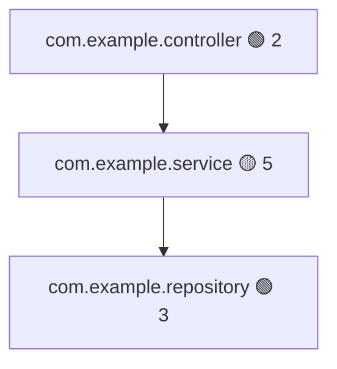
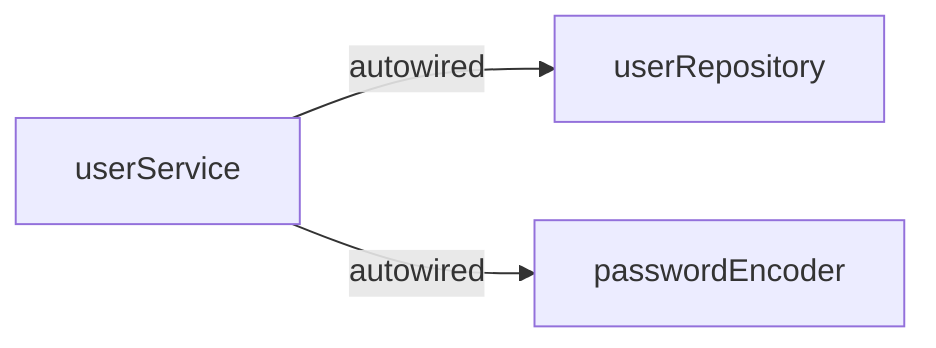

# Code Analysis & Context Engineering MCP - Java/Spring Boot Edition

A Model Context Protocol (MCP) server in Java for analyzing Spring Framework and Spring Boot projects, providing deep codebase understanding through architectural analysis, pattern detection, and AI-optimized context generation.

## 🎯 Project Status

### ✅ Completed (Phases 1-4)

**Phase 1: MCP Server Core** (21 tests passing)
- ✅ MCP Server infrastructure with stdio communication
- ✅ JSON-RPC protocol handler
- ✅ Tool registry system

**Phase 2: Parsers & Utilities** (57 tests passing)
- ✅ JavaSourceParser - Parse Java source files with JavaParser library
- ✅ XmlConfigParser - Parse Spring XML configurations (beans, namespaces)
- ✅ MavenParser - Parse pom.xml dependencies
- ✅ YamlPropertiesParser - Parse application.yml/properties files

**Phase 3: Graph & Diagram Generation** (113 tests passing)
- ✅ DependencyGraph - Package dependency analysis with circular detection
- ✅ BeanDependencyGraph - Spring bean dependency analysis (XML + annotations)
- ✅ DiagramGenerator - Mermaid diagram generation
- ✅ ComplexityAnalyzer - Cyclomatic complexity calculation
- ✅ FileScanner - File discovery with glob patterns
- ✅ FrameworkDetector - Detect Spring Boot, Spring MVC, JPA, Security, AOP

**Phase 4: Framework Analyzers** (75 tests passing)
- ✅ SpringFrameworkAnalyzer - Traditional Spring XML analysis (MVC, TX, AOP, Data Access)
- ✅ SpringBootAnalyzer - Spring Boot patterns, starters, auto-configuration
- ✅ JpaAnalyzer - JPA/Hibernate entities, relationships, N+1 detection
- ✅ SecurityAnalyzer - Spring Security patterns, authentication, authorization
- ✅ AopAnalyzer - Aspect detection, pointcuts, advice types

**Total: 266 tests passing** ✅

## 📋 Key Features Implemented

### Spring Framework Support
- **Traditional Spring** - XML bean definitions, Spring MVC, transaction management, AOP
- **Spring Boot** - Auto-configuration, starters, application.yml/properties, components
- **Mixed configurations** - Supports both XML and annotation-based configurations

### Analysis Capabilities
- **Architectural Analysis** - Package structure, class hierarchies, Spring component dependencies
- **Pattern Detection** - Spring patterns (MVC, REST, JPA, Security, AOP) in both XML and annotations
- **Complexity Metrics** - Cyclomatic complexity, lines of code, method counts
- **Dependency Analysis** - Package imports, Maven dependencies, bean wiring (XML + Java)
- **Circular Dependency Detection** - Detects cycles in both package imports and Spring bean dependencies
- **JPA Analysis** - Entity relationships, fetch types, bidirectional mappings, N+1 query detection
- **Security Analysis** - Authentication mechanisms, authorization rules, method-level security
- **AOP Analysis** - Aspect detection, pointcut expressions, advice types

### Diagram Generation
- **Architecture Diagrams** - Package structure with complexity heatmaps
- **Dependency Graphs** - Package dependencies with circular dependency highlighting
- **Bean Dependency Graphs** - Spring bean wiring visualization
- **Mermaid Format** - Industry-standard diagram syntax for easy rendering

## 🏗️ Architecture

```
code-analysis-context-java-spring-mcp/
├── src/main/java/com/mcp/codeanalysis/
│   ├── server/               # MCP server core (21 tests)
│   │   ├── McpServer.java
│   │   ├── JsonRpcHandler.java
│   │   └── ToolRegistry.java
│   ├── tools/                # MCP tools (in progress)
│   │   └── ArchitectureAnalyzer.java
│   ├── analyzers/            # Framework analyzers (75 tests)
│   │   ├── SpringFrameworkAnalyzer.java (14 tests)
│   │   ├── SpringBootAnalyzer.java (13 tests)
│   │   ├── JpaAnalyzer.java (15 tests)
│   │   ├── SecurityAnalyzer.java (16 tests)
│   │   └── AopAnalyzer.java (17 tests)
│   ├── parsers/              # File parsers (57 tests)
│   │   ├── JavaSourceParser.java (9 tests)
│   │   ├── XmlConfigParser.java (13 tests)
│   │   ├── MavenParser.java (14 tests)
│   │   └── YamlPropertiesParser.java (21 tests)
│   ├── graph/                # Dependency graphs (33 tests)
│   │   ├── DependencyGraph.java (16 tests)
│   │   └── BeanDependencyGraph.java (17 tests)
│   ├── utils/                # Utilities (80 tests)
│   │   ├── ComplexityAnalyzer.java (20 tests)
│   │   ├── DiagramGenerator.java (19 tests)
│   │   ├── FileScanner.java (24 tests)
│   │   └── FrameworkDetector.java (17 tests)
│   └── types/                # Data types and DTOs
│       ├── JavaFileInfo.java
│       ├── XmlBeanDefinition.java
│       └── ...
└── src/test/java/           # Comprehensive test suite (266 tests)
```

## 🧪 Testing

All 266 tests passing with comprehensive coverage:

```bash
mvn test

Tests run: 266, Failures: 0, Errors: 0, Skipped: 0
```

### Test Coverage by Component

| Component | Tests | Status |
|-----------|-------|--------|
| MCP Server Core | 21 | ✅ |
| Parsers | 57 | ✅ |
| Graph & Utils | 113 | ✅ |
| Framework Analyzers | 75 | ✅ |
| **Total** | **266** | **✅** |

## 🚀 Getting Started

### Prerequisites

- Java 17 or higher
- Maven 3.8+

### Build

```bash
mvn clean package
```

### Run Tests

```bash
mvn test
```

### Run Specific Test Suite

```bash
mvn test -Dtest=SpringBootAnalyzerTest
mvn test -Dtest=JpaAnalyzerTest
mvn test -Dtest=SecurityAnalyzerTest
```

## 📊 Implementation Highlights

### 1. Annotation Parameter Extraction

Enhanced JavaParser integration to extract full annotation details, enabling detection of:
- JPA `@OneToMany(mappedBy = "author")` - bidirectional relationship detection
- JPA `@OneToMany(fetch = FetchType.EAGER)` - N+1 query detection
- AOP `@Pointcut("execution(* com.example.*.*(..))")` - pointcut expression extraction
- AOP `@Before("serviceMethods()")` - advice-pointcut binding

### 2. Dual Configuration Support

Unified analysis of XML and annotation-based Spring configurations:
- XML bean definitions with property/constructor injection
- Java @Configuration classes with @Bean methods
- Mixed XML + annotation configurations
- Spring namespace detection (beans, context, tx, aop, mvc, security)

### 3. Circular Dependency Detection

Advanced cycle detection using Tarjan's algorithm via JGraphT:
- Package-level circular dependencies from imports
- Spring bean circular dependencies from XML and @Autowired
- Detailed cycle paths for debugging

### 4. Mermaid Diagram Generation

Professional diagrams with:
- Complexity-based color coding (green → yellow → orange → red)
- Package relationship visualization
- Bean dependency wiring graphs
- Circular dependency highlighting

## 🔍 Example Usage

### Analyze Spring Boot Project

```java
SpringBootAnalyzer analyzer = new SpringBootAnalyzer();
SpringBootAnalyzer.SpringBootAnalysisResult result = analyzer.analyze(
    javaFiles,      // List<Path> to .java files
    pomFile,        // Path to pom.xml
    configFiles     // List<Path> to application.yml/properties
);

// Results
result.isSpringBootDetected();  // true
result.getMainClass();          // "com.example.Application"
result.getStarters();           // ["web", "data-jpa", "security"]
result.getFeatures();           // ["Spring MVC / REST", "Spring Data JPA", ...]
result.getServerPort();         // 8080
result.getActiveProfiles();     // ["dev", "mysql"]
```

### Analyze JPA Entities

```java
JpaAnalyzer analyzer = new JpaAnalyzer();
JpaAnalyzer.JpaAnalysisResult result = analyzer.analyze(javaFiles);

result.getEntityCount();                    // 5
result.getRelationshipCount();              // 8
result.getEntitiesWithIssues();             // Entities missing @Id, equals/hashCode
result.getAllPotentialNPlusOneQueries();    // ["User.orders", "Author.books"]
```

### Detect Circular Dependencies

```java
DependencyGraph graph = new DependencyGraph();
graph.buildFromJavaFiles(javaFiles);
List<List<String>> cycles = graph.detectCircularDependencies();
// [["com.example.service", "com.example.repository", "com.example.service"]]
```

### Generate Architecture Diagram

```java
DiagramGenerator generator = new DiagramGenerator();
String diagram = generator.generateArchitectureDiagram(packageStructure);
// Returns Mermaid diagram syntax
```

## 🎨 Mermaid Diagram Examples

### Package Architecture



### Bean Dependencies



## 📝 Git Workflow

This project follows atomic commit practices:
- Each component gets separate implementation and test commits
- All commits co-authored with Claude Sonnet 4.5
- Branch-per-phase strategy (phase-4-analyzers currently)

### Recent Commits

```
d8d6147 test: Add comprehensive tests for AopAnalyzer
e2db8d3 feat: Implement AopAnalyzer for Spring AOP pattern detection
75e2059 feat: Add annotationDetails support for MethodInfo
48aa5af test: Add comprehensive tests for SecurityAnalyzer
8f7ad82 feat: Implement SecurityAnalyzer for Spring Security pattern detection
...
```

## ✅ Phase 5 Complete: MCP Tools (6 tools)

### All Tools Implemented
- ✅ **ArchitectureAnalyzer** - Comprehensive architecture analysis with complexity metrics
- ✅ **DependencyMapper** - Package/bean dependency graphs with circular detection
- ✅ **PatternDetector** - Spring pattern detection (Boot, MVC, JPA, Security, AOP)
- ✅ **CoverageAnalyzer** - JaCoCo report parsing with test scaffold generation
- ✅ **ConventionValidator** - Java/Spring naming and best practice validation
- ✅ **ContextPackGenerator** - AI-optimized context packs with token budgets

### Next Steps
- ⏳ Tool registration with MCP server
- ⏳ JSON-RPC method handlers for each tool
- ⏳ Integration tests with sample Spring projects
- ⏳ Production deployment configuration

## 🛠️ Technology Stack

- **Java 17** - Modern Java with records, text blocks, pattern matching
- **JavaParser 3.25.8** - Java AST parsing
- **DOM4J 2.1.4** + **Jaxen 2.0.0** - XML parsing with XPath
- **Jackson 2.16.1** - JSON and YAML processing
- **Maven Model 3.9.6** - pom.xml parsing
- **JGraphT 1.5.2** - Graph algorithms (Tarjan's for cycle detection)
- **JUnit 5** - Testing framework
- **Logback 1.4.14** - Logging

## 📄 License

MIT

## 👨‍💻 Authors

Adapted for Java/Spring Boot

Co-Authored-By: Claude Sonnet 4.5 <noreply@anthropic.com>

## 🙏 Acknowledgments

Based on the Python version: [code-analysis-context-python-mcp](https://github.com/andreahaku/code-analysis-context-python-mcp)

Related Projects:
- [llm-memory-mcp](https://github.com/andreahaku/llm_memory_mcp) - Persistent memory for LLM tools
- [code-analysis-context-mcp](https://github.com/andreahaku/code-analysis-context-mcp) - TypeScript/JavaScript version

---

**Status**: ✅ Phase 5 Complete - All 6 MCP Tools Implemented (266 tests passing)
